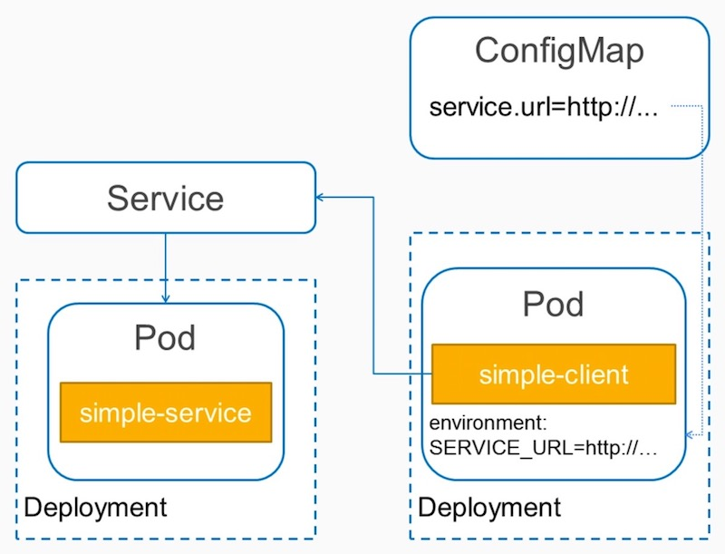

# Implement Go Microservice Discovery and Configuration with Kubernetes

## Kubernetes Concepts



### Service
Abstraction for a logical collection of pods; provides a DNS name.

### ConfigMap
Contains a set of named strings; used as ENV variables or volumes.

## Building docker images

```bash
$ docker-compose build
WARNING: Some services (simple-k8s-server) use the 'deploy' key, which will be ignored. Compose does not support 'deploy' configuration - use `docker stack deploy` to deploy to a swarm.
Building simple-k8s-server
Step 1/6 : FROM golang:1.8.1-alpine
 ---> 32efc118745e
Step 2/6 : ENV SOURCES /go/src/github.com/PacktPublishing/Advanced-Cloud-Native-Go/Discovery/Kubernetes/
 ---> Running in 8d30fe2e7fa7
Removing intermediate container 8d30fe2e7fa7
 ---> 8d8408eb8bac
Step 3/6 : COPY . ${SOURCES}
 ---> 0627f1cbf0d5
Step 4/6 : RUN cd ${SOURCES}server/ && CGO_ENABLED=0 go build
 ---> Running in 21abe82d890f
Removing intermediate container 21abe82d890f
 ---> da3c0f2a6d2e
Step 5/6 : WORKDIR ${SOURCES}server/
 ---> Running in 501942e26ad8
Removing intermediate container 501942e26ad8
 ---> 5adf3ea4dcd5
Step 6/6 : CMD ${SOURCES}server/server
 ---> Running in 35cb22492c9f
Removing intermediate container 35cb22492c9f
 ---> bfcc6231cc24
Successfully built bfcc6231cc24
Successfully tagged simple-k8s-server:1.0.1
Building simple-k8s-client
Step 1/6 : FROM golang:1.8.1-alpine
 ---> 32efc118745e
Step 2/6 : ENV SOURCES /go/src/github.com/PacktPublishing/Advanced-Cloud-Native-Go/Discovery/Kubernetes/
 ---> Using cache
 ---> 8d8408eb8bac
Step 3/6 : COPY . ${SOURCES}
 ---> Using cache
 ---> 0627f1cbf0d5
Step 4/6 : RUN cd ${SOURCES}client/ && CGO_ENABLED=0 go build
 ---> Running in e5f1649776db
Removing intermediate container e5f1649776db
 ---> ef88512cf83b
Step 5/6 : WORKDIR ${SOURCES}client/
 ---> Running in e1090252352d
Removing intermediate container e1090252352d
 ---> 67ae7e6e61f2
Step 6/6 : CMD ${SOURCES}client/client
 ---> Running in d18b516d1775
Removing intermediate container d18b516d1775
 ---> 3a3a19a321af
Successfully built 3a3a19a321af
Successfully tagged simple-k8s-client:1.0.1
```

now we have available the new docker images:
```bash
$ docker images
REPOSITORY             TAG                 IMAGE ID            CREATED             SIZE
simple-k8s-client      1.0.1               3a3a19a321af        44 seconds ago      262MB
simple-k8s-server      1.0.1               bfcc6231cc24        51 seconds ago      263MB
```


## Tagging and pushing to remote registry

### Tag
We can tag a docker image with (using the docker hub username):
```
docker tag simple-k8s-client:1.0.1 danigilmayol/simple-k8s-client:1.0.1
docker tag simple-k8s-server:1.0.1 danigilmayol/simple-k8s-server:1.0.1
```

Once tagged we can list again the docker images to verify that the new tagged is listed:
```
$ docker images
REPOSITORY                       TAG                 IMAGE ID            CREATED             SIZE
danigilmayol/simple-k8s-client   1.0.1               3a3a19a321af        3 minutes ago       262MB
simple-k8s-client                1.0.1               3a3a19a321af        3 minutes ago       262MB
danigilmayol/simple-k8s-server   1.0.1               bfcc6231cc24        3 minutes ago       263MB
simple-k8s-server                1.0.1               bfcc6231cc24        3 minutes ago       263MB
```


### Push
Now we can use the following command for pushing the tagged image to the docker hub repository (using the docker.io username):
``` bash
$ docker push danigilmayol/simple-k8s-client:1.0.1
The push refers to repository [docker.io/danigilmayol/simple-k8s-client]
4d7e2671d1a0: Pushed 
0ccda82e2d32: Pushed 
bf24f77dead4: Mounted from library/golang 
fe6a76f83540: Mounted from library/golang 
b0252301604b: Mounted from library/golang 
23ffabff0295: Mounted from library/golang 
ba5126b459c9: Mounted from library/golang 
e154057080f4: Mounted from library/golang 
1.0.1: digest: sha256:015f09924337bb7d77d78da53ffcdc4add142c297c1954b8f0ffeeda3489cbb9 size: 1991
```

``` bash
$ docker push danigilmayol/simple-k8s-server:1.0.1
The push refers to repository [docker.io/danigilmayol/simple-k8s-server]
2d1ab5ed2e0b: Pushed 
0ccda82e2d32: Mounted from danigilmayol/simple-k8s-client 
bf24f77dead4: Mounted from danigilmayol/simple-k8s-client 
fe6a76f83540: Mounted from danigilmayol/simple-k8s-client 
b0252301604b: Mounted from danigilmayol/simple-k8s-client 
23ffabff0295: Mounted from danigilmayol/simple-k8s-client 
ba5126b459c9: Mounted from danigilmayol/simple-k8s-client 
e154057080f4: Mounted from danigilmayol/simple-k8s-client 
1.0.1: digest: sha256:a103507b7bd4f43d9406ecf72778b485649ce0961edfb884144951ab0f274d71 size: 1991
```

Now the docker images are available from docker hub.


## Server
The server service is defined in `/server/simple-k8s-server.go`. It is a simple http server that have a single endpoint `/info`.

We have defined the deployment YAML file `simple-k8s-server-deployment.yaml` to deploy the `simple-k8s-server` container to Kubernetes on port 9090, defining a readiness probe.

Moreover, we have define a service definition for the previous deployment in the YAML file `simple-k8s-server-service.yaml`, so that we can access the server pods using a DNS name.


We can deploy to Kubernetes first the deployment:
``` bash
$ cd ./Discovery/Kubernetes
$ kubectl apply -f simple-k8s-server-deployment.yaml
deployment.extensions "simple-k8s-server" created
```

and then deploy the service:
```bash
$ kubectl apply -f simple-k8s-server-service.yaml
service "simple-k8s-server" created
```

Check the pods running:
```bash 
$ kubectl get pods
NAME                                 READY     STATUS    RESTARTS   AGE
simple-k8s-server-54f6786449-9gzww   1/1       Running   0          2m
simple-k8s-server-54f6786449-zzpv4   1/1       Running   0          2m
```

now we can also access the services:
```bash 
$ kubectl get services
NAME                TYPE        CLUSTER-IP       EXTERNAL-IP   PORT(S)          AGE
kubernetes          ClusterIP   10.96.0.1        <none>        443/TCP          5d
simple-k8s-server   NodePort    10.107.233.232   <none>        9090:30212/TCP   1m
```

## ConfigMap
The ConfigMap definition is defined in file `simple-k8s-configmap.yaml`. We define a service URL for our simple-server that the client will use later on to look up our service.

Deploy the ConfigMap to Kubernetes:
```
$ kubectl apply -f simple-k8s-configmap.yaml
configmap "simple-k8s-config" created
```

## Client
The client service is defined in `/client/simple-k8s-client.go`. The function `initServiceURL` initialize the service URL from the environment variable `SERVICE_URL`. 

This environment variable is retrieved from the ConfigMap as defined in file `simple-k8s-client-deployment.yaml`:
``` 
      containers:
      - env:
        - name: SERVICE_URL
          valueFrom: 
            configMapKeyRef:
              name: simple-k8s-config
              key: service.url
```

Deploy the client configuration to Kubernetes:
```bash 
$ kubectl apply -f simple-k8s-client-deployment.yaml
deployment.extensions "simple-k8s-client" created
```

Now if we list the pods we can see the new client pod:
```bash 
$ kubectl get pods
NAME                                 READY     STATUS    RESTARTS   AGE
simple-k8s-client-8445474b45-5k7kx   1/1       Running   0          23s
simple-k8s-server-54f6786449-9gzww   1/1       Running   0          15m
simple-k8s-server-54f6786449-zzpv4   1/1       Running   0          15m
```

We can list also the ConfigMap available:
```bash
$ kubectl get configmap
NAME                DATA      AGE
simple-k8s-config   1         2m
```

We can check the client logs:
```bash 
2019-03-21T10:35:22.183337202Z (ENV) SERVICE_URL: http://simple-k8s-server:9090/infoHello Kubernetes Discovery & Configuration. Time is 2019-03-21 10:35:22.149696705 +0000 UTC
2019-03-21T10:35:27.151003024Z Hello Kubernetes Discovery & Configuration. Time is 2019-03-21 10:35:27.150025395 +0000 UTC
2019-03-21T10:35:32.151523524Z Hello Kubernetes Discovery & Configuration. Time is 2019-03-21 10:35:32.150024818 +0000 UTC
2019-03-21T10:35:37.151047272Z Hello Kubernetes Discovery & Configuration. Time is 2019-03-21 10:35:37.149896798 +0000 UTC
2019-03-21T10:35:42.150756995Z Hello Kubernetes Discovery & Configuration. Time is 2019-03-21 10:35:42.149736266 +0000 UTC
2019-03-21T10:35:47.151071223Z Hello Kubernetes Discovery & Configuration. Time is 2019-03-21 10:35:47.149833414 +0000 UTC
```
and we will see that the client prints the message received from the server each 5 seconds.

If we check the server logs we will see the corresponding messages from the client requests:
``` bash
2019-03-21T10:35:29.510184577Z The /info endpoint is being called...
2019-03-21T10:35:35.298218171Z The /info endpoint is being called...
2019-03-21T10:35:39.509426673Z The /info endpoint is being called...
2019-03-21T10:35:45.298700271Z The /info endpoint is being called...
```